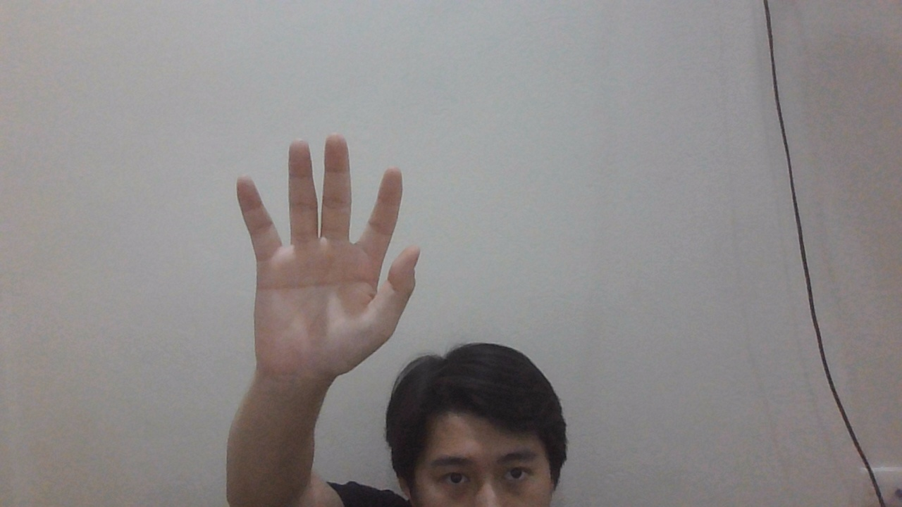
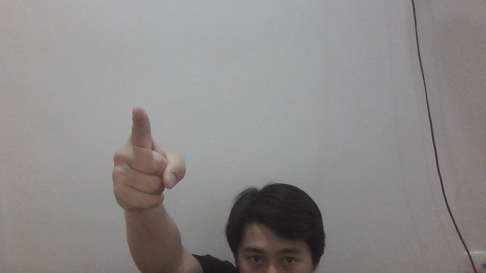
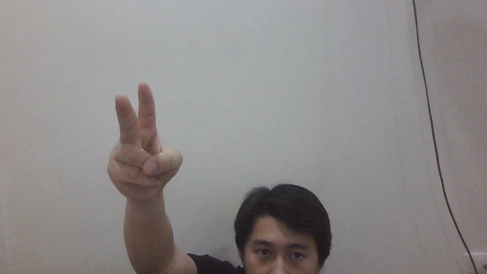
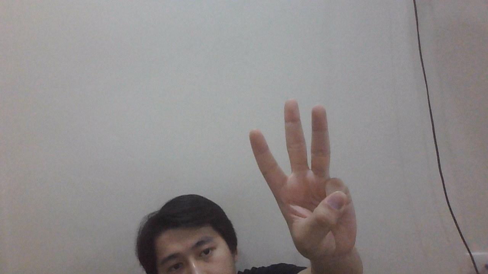
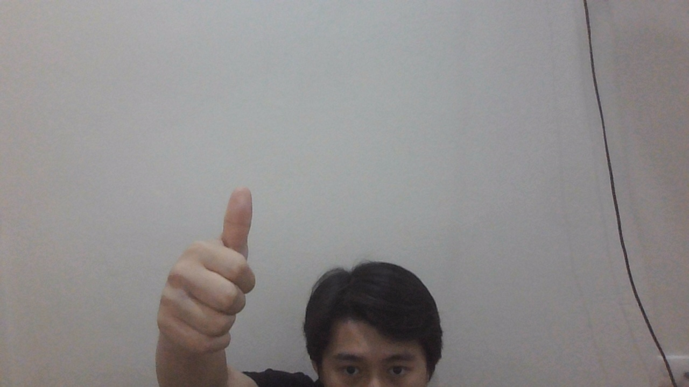

# Light Controlling Using Hand Gestures


The "Light Controlling Using Hand Gestures" project develops a system that allows users to control lights through hand gestures. This project combines Google's gesture recognition technology (MediaPipe Gesture Recognizer) with a Deep Learning Model to create a system that recognizes hand gestures and executes commands corresponding to predefined gestures. The system can control lights in a simulated environment or real lighting devices via a Modbus RTU RS485 relay module.

## Key Features

*   **Real-time Hand Gesture Recognition**: Utilizes MediaPipe Gesture Recognizer to detect and extract hand landmarks from a webcam feed.
*   **Deep Learning Model**: An MLP (Multi-Layer Perceptron) model is trained to classify hand gestures into specific light control actions.
*   **Flexible Light Control**: Supports light control in simulated environments and physical lighting devices via a 4-channel Modbus RTU RS485 relay module.
*   **Easy Extensibility**: Gesture and corresponding action configurations are defined in the `hand_gesture.yaml` file, allowing for easy addition or modification of new gestures.
*   **Automated Data Collection**: The `generate_landmark_data.py` tool helps efficiently collect hand gesture landmark data for model training.

## Project Structure

The project is organized with the following main directories and files:

```
Light-Controlling-Using-Hand-Gestures/
├── data/                       # Contains CSV files for landmark data (train, val, test)
├── img/                        # Contains illustrative images for README
├── models/                     # Contains the trained deep learning model
├── sign_imgs/                  # Contains sample images of gestures
├── .gitignore                  # Files and directories to ignore in Git commits
├── Light Controlling Using Hand Gestures.pdf # Detailed project guide document
├── README.md                   # Project README file
├── controller.py               # Handles light control logic (interacts with relay)
├── detect_simulation.py        # Simulates gesture recognition and light control
├── generate_landmark_data.py   # Script for collecting hand landmark data from gestures
├── hand_gesture.yaml           # Configuration for hand gestures and corresponding actions
├── model.py                    # Defines the deep learning model architecture
├── requirements.txt            # List of required Python libraries
├── train.py                    # Script for training the deep learning model
└── utils.py                    # General utility functions
```

## Usage

### 1. Gesture Configuration

The `hand_gesture.yaml` file defines hand gestures and their corresponding light control actions. You can edit this file to add or modify gestures:

```yaml
gestures:
  0: "turn_off"
  1: "light1"
  2: "light2"
  3: "light3"
  4: "turn_on"
```

### 2. Gesture Data Collection

Use `generate_landmark_data.py` to collect landmark data for hand gestures. This data will be used to train the model.

```bash
python generate_landmark_data.py
```

**Data Collection Guide:**

*   The program will automatically create `landmark_train.csv`, `landmark_val.csv`, `landmark_test.csv` files in the `data/` directory.
*   When the program runs, you will see a webcam window. Press the key corresponding to the gesture class you want to record (e.g., 'a' for class 0, 'b' for class 1, etc.).
*   Perform the gesture in front of the camera. Data will be continuously recorded.
*   Press the selected key again to stop recording data for that gesture.
*   Repeat the process for other gestures. After completing all classes, press 'q' to exit the program.

### 3. Model Training

Once you have the data, you can train the gesture classification model by running:

```bash
python train.py
```

The trained model will be saved in the `models/` directory.

### 4. Light Control (Simulation)

To run the simulated light control using hand gestures, use:

```bash
python detect_simulation.py
```

The program will use your webcam to recognize your gestures and display the corresponding light control actions on the screen.

### 5. Light Control (Physical - IoT)

To control physical lights, you will need a 4-channel Modbus RTU RS485 relay module and a USB to RS485 converter. Connect the devices according to the diagram and run:

```bash
python controller.py
```

**Note**: Ensure that the COM port and Modbus address in `controller.py` are correctly configured to match your hardware setup.

## Gestures and Actions

The table below describes the defined hand gestures and their corresponding light control actions:

| Class | Action              | Hand Gesture                                  |
|-------|---------------------|-----------------------------------------------|
| 0     | Turn All Lights Off |  |
| 1     | Turn Light 1 On     |  |
| 2     | Turn Light 2 On     |  |
| 3     | Turn Light 3 On     |  |
| 4     | Turn All Lights On  |  |
