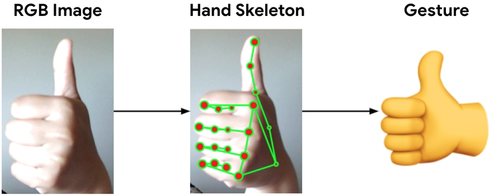
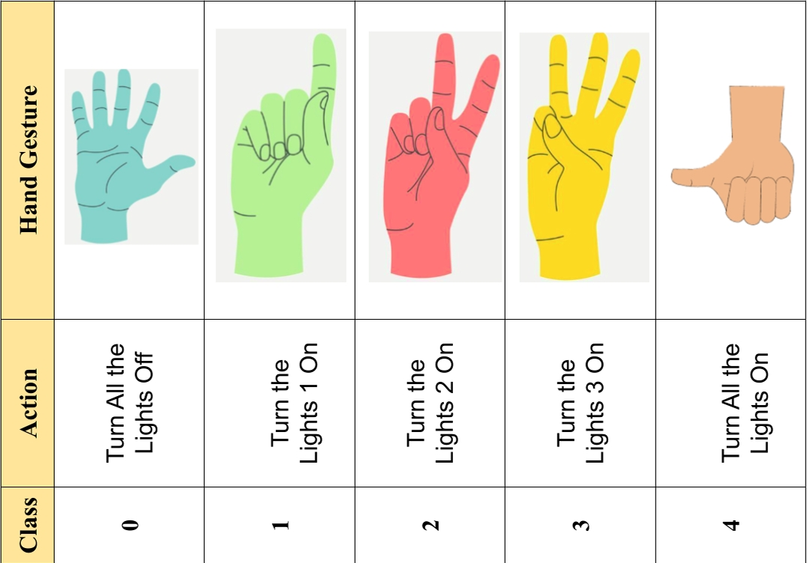

# Light Control Using Hand Gestures 🖐️💡



This project enables users to control lights using hand gestures, integrating Google's MediaPipe Gesture Recognizer with a deep learning model for real-time gesture classification. The system supports both simulated environments and physical lighting devices via a Modbus RTU RS485 relay module.

## Key Features ✨

- **Real-time Gesture Recognition** 🕹️: Detects hand landmarks from a webcam feed using MediaPipe Gesture Recognizer.
- **Deep Learning Classification** 🧠: Utilizes a Multi-Layer Perceptron (MLP) to classify gestures into light control commands.
- **Flexible Control** ⚙️: Manages lights in simulated or physical setups using a 4-channel Modbus RTU RS485 relay module.
- **Customizable Gestures** 📝: Define gestures and actions in the `hand_gesture.yaml` file for easy modification.
- **Automated Data Collection** 📊: Simplifies gesture data collection with `generate_landmark_data.py`.

## Project Structure 📁

```
Light-Control-Using-Hand-Gestures/
├── data/                       # Landmark data (train, val, test CSV files) 📈
├── img/                        # README images 🖼️
├── models/                     # Trained deep learning model 🤖
├── sign_imgs/                  # Sample gesture images ✋
├── .gitignore                  # Git ignore file 🙈
├── Light Controlling Using Hand Gestures.pdf # Project guide 📄
├── README.md                   # This file 📖
├── controller.py               # Physical light control logic 💡
├── detect_simulation.py        # Simulated gesture-based control 🎮
├── generate_landmark_data.py   # Gesture data collection script 📷
├── hand_gesture.yaml           # Gesture-action configuration ⚙️
├── model.py                    # Deep learning model architecture 🧠
├── train.py                    # Model training script 🏋️
├── utils.py                    # Utility functions 🛠️
```

## Getting Started 🚀

### 1. Configure Gestures ⚙️

Edit `hand_gesture.yaml` to define gestures and their corresponding light control actions:

```yaml
gestures:
  0: "turn_off"  # ✋ Turn off lights
  1: "light1"    # 💡 Light 1
  2: "light2"    # 💡 Light 2
  3: "light3"    # 💡 Light 3
  4: "turn_on"   # 🌟 All lights on
```

### 2. Collect Gesture Data 📷

Run the data collection script to gather hand landmark data:

```bash
  python generate_landmark_data.py
```

- A webcam window will open. Press a key (e.g., 'a' for class 0, 'b' for class 1) to start/stop recording a gesture.
- Perform the gesture in front of the camera.
- Repeat for all gestures, then press 'q' to exit.
- Data is saved as `landmark_train.csv`, `landmark_val.csv`, and `landmark_test.csv` in the `data/` directory.

### 3. Train the Model 🏋️

Train the gesture classification model:

```bash
  python train.py
```

The trained model is saved in the `models/` directory.

### 4. Run Simulation 🎮

Test gesture-based light control in a simulated environment:

```bash
  python detect_simulation.py
```

The webcam will detect gestures and display corresponding actions on-screen.

### 5. Control Physical Lights 💡

For physical light control, connect a 4-channel Modbus RTU RS485 relay module and a USB to RS485 converter, then run:

```bash
  python controller.py
```

Ensure the COM port and Modbus address in `controller.py` match your hardware setup.

## Gestures and Actions 📋

 